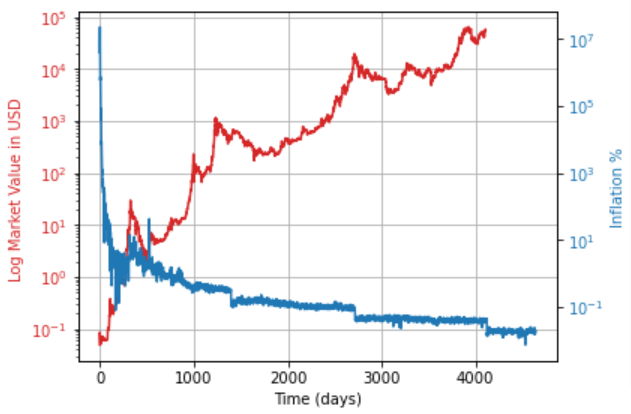
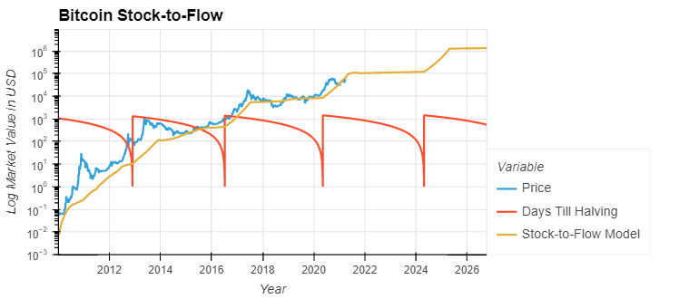
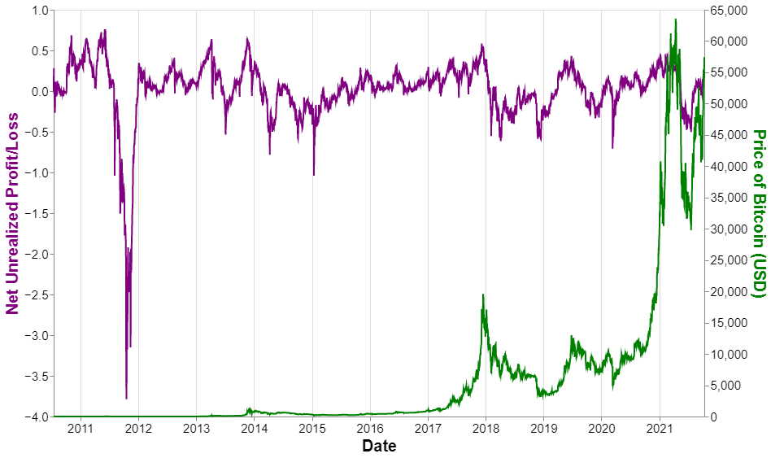

### Bitcoins Price History
### Group 5
### By Mike, William, Ryan

# Summary of major findings

## Summary / Motivation
Our project focuses on a macro view of Bitcoin’s price history to uncover trends / patterns, and to better understand past & present valuation. Future efforts might be concentrated in formulating an understanding of future maximum & minimum valuations over the coming 3-5 years.
The questions we asked of the data were greatly influenced by Glassnode.com - They provide blockchain data, on-chain metrics, and a vast array of tools for any curious data explorers that may find conventional valuation metrics to be insufficient for analysing crypto markets.

## How does Bitcoin's inflation rate affect value?
## What happens when the inflation rate reaches 0?

From our plot, one can see that as the inflation rate decreases the price continues to grow as the new supply of Bitcoin dwindles and demand for Bitcoin Increases. Halvings also cause the supply growth rate to be stepped and not smooth as shown. Once the inflation rate reaches zero, miners will no longer be able to earn money from minting newly created bitcoins. Instead, transaction fees will have to increase or the number of transactions will have to increase. Furthermore, once Bitcoin has reached its fixed supply of 21 million any Bitcoin that is lost is permanently removed from the money supply meaning the total supply will decrease or deflate over time. As a result, Bitcoin will become increasingly more scarce and increase in value. However, we may never know the exact amount of Bitcoin that has been lost.

## Does scarcity drive value?
From looking at our plot we can see that a statistically significant relationship between stock-to-flow and market value does exist. It's unlikely that the relationship between stock-to-flow and market value is caused by chance. While Stock to Flow is an interesting model for measuring scarcity, it doesn’t account for all the pieces of the pie. Models are only as strong as their assumptions. Stock to Flow relies heavily on the assumption that scarcity, as measured by our model, should drive value. This model fails if Bitcoin doesn’t have any other useful qualities other than supply scarcity.

### When is the best time to enter / exit the Bitcoin market?

We can utilize the MVRV ratio in a macro point of view to enter the market anytime the ratio falls below 1. We can also use this ratio to take profits anytime the ratio goes above 3.7

.

### Will a standard deviation metric aid in identifying extreme periods of over/undervaluation?

By subtracting the realized cap from the market cap, and then dividing by the standard deviation of the market cap we obtain the MVRV Z-Score. When the score is near or below zero, it has historically proven to be an excellent time to long the market. When the score rises above 7, Bitcoin is considered to be overvalued and this is a good time to consider taking profits.

## Why is Net Unrealized Profit/Loss a useful metric?

NUPL was created in order to determine the total amount of profits or losses from the circulating supply of a coin. Whenever you look at this metric and you see it at a certain point you can determine whether it’s a good time to buy/sell/stay your position on your Bitcoin. This metric can be a very useful tool to better your investment strategy with Bitcoin to make you more profitable.

* Under 0% is the capitulation phase which is the best time to buy Bitcoin.
* Between 0-25% is the hope/fear stage.
* Between 25-50% is the optimism/anxiety stage.
* Between 50-75% is the belief/denial stage.
* Once above 75% is the euphoria/greed stage and the historical data shows that Bitcoin is at a market top. Best time to sell.

## Glassnode API

* [glassnode](https://glassnode.com/)
